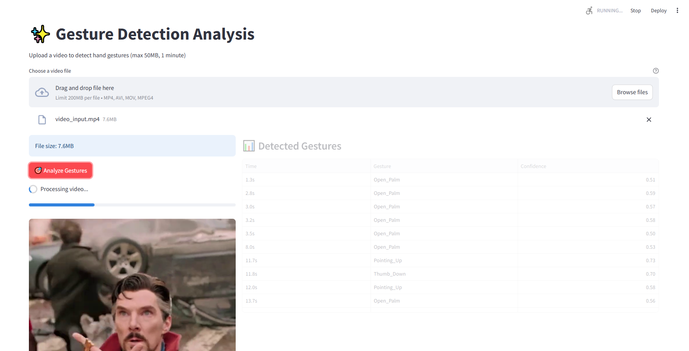

# Gesture Detection Analysis App

## About The Project

This Streamlit application provides gesture detection analysis using MediaPipe's Gesture Recognizer model. Upload a video file, and the application will analyze it to detect and recognize various hand gestures throughout the video, providing timestamps for each detected gesture.

Key features:

- Video upload interface
- Results displayed in an organized table format
- Timestamp-based gesture tracking
- Powered by MediaPipe's Gesture Recognition model

## Built With

- Streamlit
- OpenCV
- MediaPipe
- Python

## App Screenshot



## Prerequisites

The application requires the MediaPipe Gesture Recognizer model. Download it using:

```sh
powershell -Command "Invoke-WebRequest -Uri https://storage.googleapis.com/mediapipe-models/gesture_recognizer/gesture_recognizer/float16/1/gesture_recognizer.task -OutFile models/gesture_recognizer.task"
```

## Local Setup

1. Clone the repo

   ```sh
   git clone https://github.com/pedropcamellon/gesture-detection-analysis.git
   cd gesture-detection-analysis
   ```

2. Install the required libraries using uv

   ```sh
   uv sync
   ```

3. Run the Streamlit app

   ```sh
   streamlit run src/app.py
   ```

## Usage

1. Open the application in your web browser
2. Upload a video file using the file uploader
3. Click the "Run Analysis" button
4. Wait for the processing to complete
5. View the results in the table showing gestures and their timestamps

## Output Format

The analysis results are displayed in a table with the following columns:

- Timestamp: When the gesture was detected
- Gesture: The name of the detected gesture
- Confidence: Confidence score of the detection
